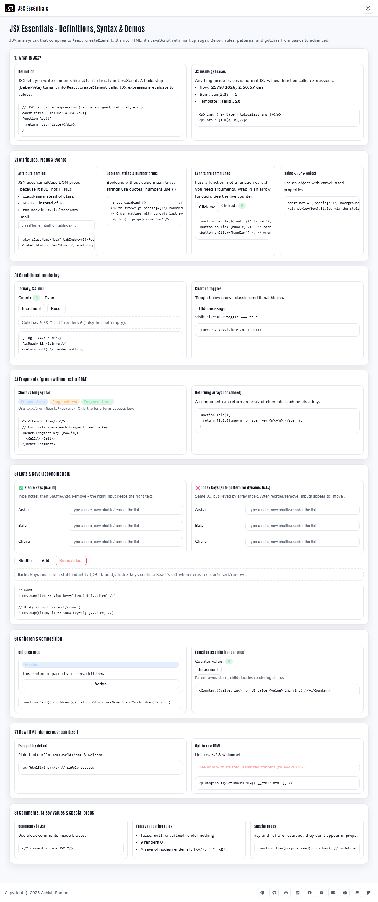

# JSX Essentials

An interactive React and Vite reference for learning JSX syntax, props, events, conditional rendering, lists, keys, composition and safe raw HTML handling.



## Features

- Clear explanations with working JSX examples
- Interactive counters, toggles, inputs and list-key demos
- Dark and light theme with saved preference
- Responsive cards, code examples and accessible controls
- Fixed branded header with icon-only links in the footer
- Floating go-to-top control with smooth scrolling

## Tech stack

React, Vite, styled-components and React Icons.

## Run locally

```bash
npm install
npm run dev
```

## Deploy

```bash
npm run deploy
```

## Links

- Portfolio: [https://www.ashishranjan.net](https://www.ashishranjan.net)
- GitHub: [https://github.com/a2rp](https://github.com/a2rp)
- CodePen: [https://codepen.io/ash1198](https://codepen.io/ash1198)
- LinkedIn: [https://www.linkedin.com/in/aashishranjan](https://www.linkedin.com/in/aashishranjan)
- Facebook: [https://www.facebook.com/theash.ashish/](https://www.facebook.com/theash.ashish/)
- YouTube: [https://www.youtube.com/@ashishranjan-ashz?sub_confirmation=1](https://www.youtube.com/@ashishranjan-ashz?sub_confirmation=1)
- Email: [ash.ranjan09@gmail.com](mailto:ash.ranjan09@gmail.com)

## Support

- Support: [https://a2rp-donation-page.netlify.app/](https://a2rp-donation-page.netlify.app/)
- Buy Me a Coffee: [https://buymeacoffee.com/a2rp](https://buymeacoffee.com/a2rp)
- Patreon: [https://patreon.com/a2rp](https://patreon.com/a2rp)
