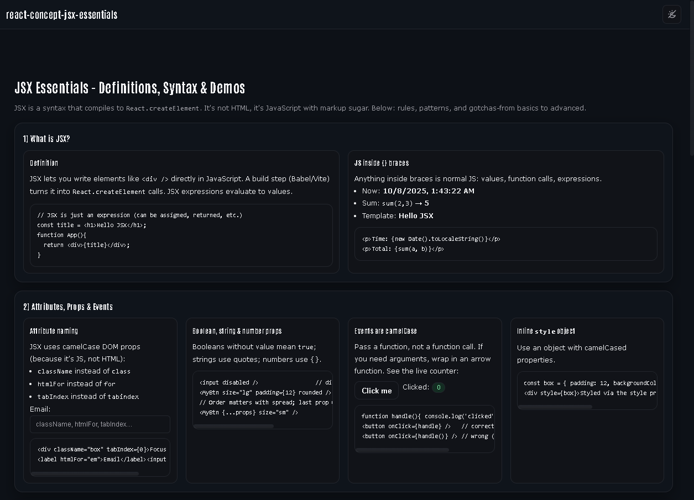

# basic-themed-app



A minimal React + Vite starter with a **premium dark/light design system** baked in.  
Uses CSS variables (design tokens), a fixed glassy header, and token-driven styled-components.

> Live: https://a2rp.github.io/basic-themed-app/  
> Repo: https://github.com/a2rp/basic-themed-app

---

## Why this exists

-   Give you a **clean, production-feel shell** you can reuse across concept demos.
-   Lock in a consistent **token system** (`--bg`, `--text`, `--accent`, etc.) for quick theming.
-   Ship fast on **GitHub Pages** with SPA refresh working (404 fallback generated automatically).

---

## Features

-   React 18 + Vite
-   Styled-components consuming CSS design tokens
-   Fixed, translucent header; footer; responsive container (`max-width: 1440px`)
-   Accessible defaults: focus rings, reduced-motion respect, visible hover/focus states
-   Dark-first tokens with light theme via `data-theme="light"` and `prefers-color-scheme` fallback
-   Print styles and scrollbars tuned for both themes
-   Zero router (add later if needed)

---

## Getting Started

```bash
git clone https://github.com/a2rp/basic-themed-app.git
cd basic-themed-app
npm install
npm run dev
```
